# GVM-Bridge

集成通过VM互调协议

### 构建工程模板

使用frontier中的template作为项目模板使用。

```sh
git clone https://github.com/paritytech/frontier.git
cd frontier
cargo build --release  //验证模板能正确编译
```

#### Runtime中添加contract pallet

./template/runtime/Cargo.toml

```sh
[dependencies]
pallet-contracts = { version = "3.0.0-dev", default-features = false, git = "https://github.com/paritytech/substrate.git", branch = "frontier" }
pallet-contracts-primitives = { version = "3.0.0-dev", default-features = false, git = "https://github.com/paritytech/substrate.git", branch = "frontier" }
pallet-contracts-rpc-runtime-api = { version = "3.0.0-dev", default-features = false, git = "https://github.com/paritytech/substrate.git", branch = "frontier" }

[features]
default = ["std", "aura"]
aura = []
manual-seal = []
std = [
# 只写出需要增加的内容
	"pallet-contracts/std",
	"pallet-contracts-primitives/std",
	"pallet-contracts-rpc-runtime-api/std",
]
```

runtime/Cargo.toml

当前目录下执行：

```sh
cargo build --release
```

确定项目模板能正确运行，同时也是加载依赖库方便后面写代码时自动补全。

### 使用GVM-Bridge

在使用之前可先参考以上内容准备好工程模板，当前案例以[此模板](###构建工程模板)为基础运行。

#### 导入Pallet Crate

要添加GVM Bridge模块，首先需要把pallet-vm-bridge crate导入到runtime的Cargo.toml文件中。

打开`./template/runtime/Cargo.toml` 文件，您将看到 runtime 的所有依赖组件，现在添加pallet-vm-bridge组件：

###### runtime/Cargo.toml

```sh
[dependencies]
#--snip--
pallet-vm-bridge = {default-features = false, git = 'https://github.com/CycanTech/GVM-Bridge.git', version = '0.1.0'}
//The generator used to supply randomness to contracts through `seal_random`.
pallet-evm-precompile-call-vm = {default-features = false, git = 'https://github.com/CycanTech/GVM-Bridge.git', version = '0.1.0'}
```

####  Crate 特性

导入pallet crates时需要注意的一件事是确保正确设置crate里的 `features`内容。当runtime是使用其自身的std特性构建时，GVM Bridge pallet 也应该使用它的std功能来构建。将以下代码添加到运行时的std特性中。

###### runtime/Cargo.toml

```sh
[features]
default = ["std"]
std = [
    #--snip--
    'pallet-vm-bridge/std',
    "pallet-evm-precompile-call-vm/std",
    #--snip--
]
```

在继续之前，可运行以下命令检查新依赖项是否正确解析:

```sh 
cargo +nightly-2021-08-01 check -p frontier-template-runtime
```

如果在添加过程中如果出现如下错误：

```sh
error: the wasm32-unknown-unknown target is not supported by default, you may need to enable the "js" feature. For more information see: https://docs.rs/getrandom/#webassembly-support
     --> /home/luo4lu/.cargo/registry/src/github.com-1ecc6299db9ec823/getrandom-0.2.3/src/lib.rs:219:9
      |
  219 | /         compile_error!("the wasm32-unknown-unknown target is not supported by \
  220 | |                         default, you may need to enable the \"js\" feature. \
  221 | |                         For more information see: \
  222 | |                         https://docs.rs/getrandom/#webassembly-support");
      | |_________________________________________________________________________^

  error[E0433]: failed to resolve: use of undeclared crate or module `imp`
     --> /home/luo4lu/.cargo/registry/src/github.com-1ecc6299db9ec823/getrandom-0.2.3/src/lib.rs:246:5
      |
  246 |     imp::getrandom_inner(dest)
      |     ^^^ use of undeclared crate or module `imp`
```

因为使用的模板函数build.rs中需要构建出一个wasm文件。而我们的项目中有使用到随机数生成，参考文档需要指定feature,添加对应crate并指定feature

runtime/Cargo.toml

```sh
getrandom = { version = "0.2", features = ["js"] }
```

#### 为以上两个pallet在Runtime 中实现

```sh
parameter_types! {
	pub const SignedClaimHandicap: u32 = 2;
	pub const TombstoneDeposit: u64 = 16;
	pub const DepositPerContract: u64 = 8 * DepositPerStorageByte::get();
	pub const DepositPerStorageByte: u64 = 10_000_000;
	pub const DepositPerStorageItem: u64 = 10_000_000;
	pub RentFraction: Perbill = PerThing::from_rational(4u32, 10_000u32);
	pub const SurchargeReward: u64 = 50_000_000;
	pub const MaxDepth: u32 = 100;
	pub const MaxValueSize: u32 = 16_384;
	pub const DeletionQueueDepth: u32 = 1024;
	pub const DeletionWeightLimit: Weight = 500_000_000_000;
	pub const MaxCodeSize: u32 = 100 * 1024;
}

impl Convert<Weight, BalanceOf<Self>> for Runtime {
	fn convert(w: Weight) -> BalanceOf<Self> {
		w.into()
	}
}

impl pallet_contracts::Config for Runtime {
	type Time = Timestamp;
	type Randomness = RandomnessCollectiveFlip;
	type Currency = Balances;
	type Event = Event;
	type RentPayment = ();
	type SignedClaimHandicap = SignedClaimHandicap;
	type TombstoneDeposit = TombstoneDeposit;
	type DepositPerContract = DepositPerContract;
	type DepositPerStorageByte = DepositPerStorageByte;
	type DepositPerStorageItem = DepositPerStorageItem;
	type RentFraction = RentFraction;
	type SurchargeReward = SurchargeReward;
	type MaxDepth = MaxDepth;
	type MaxValueSize = MaxValueSize;
	type WeightPrice = Self;
	type WeightInfo = ();
	type ChainExtension = Self;
	type DeletionQueueDepth = DeletionQueueDepth;
	type DeletionWeightLimit = DeletionWeightLimit;
	type MaxCodeSize = MaxCodeSize;
}

parameter_types! {
	pub const Enable2EVM: bool = true;
	pub const Enable2WasmC: bool = true;
}
impl pallet_vm_bridge::Config for Runtime {
	type Currency = Balances;
	type Call = Call;
	type Event = Event;
	type Enable2EVM = Enable2EVM;
	type Enable2WasmC = Enable2WasmC;
}
```

要实现GVM-Bridge的桥接调用，在配置实现pallets_contracts与pallet_evm时需要实现外部调用属性。在Runtime中添加如下代码：

```sh
impl pallet_evm_precompile_call_vm::EvmChainExtension<Runtime> for Runtime {
	fn call_vm4evm(
		origin: Origin,
		data: Vec<u8>,
		target_gas: Option<u64>,
	) -> Result<(Vec<u8>, u64), sp_runtime::DispatchError> {
		GvmBridge::call_wasm4evm(origin, data, target_gas)
	}
}
/***snip***/
impl pallet_contracts::chain_extension::ChainExtension<Runtime> for Runtime {
	fn call<E>(fun_id: u32, env: Environment<E, InitState>) -> Result<RetVal, sp_runtime::DispatchError>
	where
		E: Ext<T = Runtime>,
		<E::T as SysConfig>::AccountId: UncheckedFrom<<E::T as SysConfig>::Hash> + AsRef<[u8]>,
	{
		match fun_id {
			5 => GvmBridge::call_evm4wasm::<E>(env),
			_ => Err(sp_runtime::DispatchError::from(
				"Passed unknown func_id to chain extension",
			)),
		}
	}
}
```

修改impl pallet_evm::Config for Runtime：

```sh
impl pallet_evm::Config for Runtime：{
/***snip***/
type Precompiles = (
		pallet_evm_precompile_simple::ECRecover,
		pallet_evm_precompile_simple::Sha256,
		pallet_evm_precompile_simple::Ripemd160,
		pallet_evm_precompile_simple::Identity,
		pallet_evm_precompile_call_vm::CallVm<Self>,
		pallet_evm_precompile_modexp::Modexp,
		pallet_evm_precompile_simple::ECRecoverPublicKey,
		pallet_evm_precompile_sha3fips::Sha3FIPS256,
		pallet_evm_precompile_sha3fips::Sha3FIPS512,
	);
/***snip***/
}
```

实现pallet_contracts可调用的rpc接口：

```sh
impl pallet_contracts_rpc_runtime_api::ContractsApi<Block, AccountId, Balance, BlockNumber> for Runtime {
		fn call(
            origin: AccountId,
            dest: AccountId,
            value: Balance,
            gas_limit: u64,
            input_data: Vec<u8>,
        ) -> pallet_contracts_primitives::ContractExecResult {
            Contracts::bare_call(origin, dest, value, gas_limit, input_data)
        }
        fn get_storage(
            address: AccountId,
            key: [u8; 32]
        ) -> pallet_contracts_primitives::GetStorageResult {
            Contracts::get_storage(address, key)
        }
        fn rent_projection( address: AccountId) -> pallet_contracts_primitives::RentProjectionResult<BlockNumber> {
            Contracts::rent_projection(address)
        }
	}

```

#### 将GVM Bridge 与pallet contracts添加到construct_runtime! Macro里面

需要将GVM Bridge pallet添加到construct_runtime！宏需要确定pallet公开的类型，以便我们可以告诉runtime存在那些模块。

通过查看GVM-Bridge/frame/vm-bridge/src/lib.rs文件我们可以知道使用了：

\#[pallet::event]、\#[pallet::call]、\#[pallet::storage]、\#[pallet::pallet]

于是在我们添加pallet时：

###### runtime/src/lib.rs

```sh
construct_runtime!(
    pub enum Runtime where
        Block = Block,
        NodeBlock = opaque::Block,
        UncheckedExtrinsic = UncheckedExtrinsic
    {
        /* --snip-- */
        /*** Add These Line ***/
       Contracts: pallet_contracts::{Module, Call, Config<T>, Storage, Event<T>},
	   GvmBridge: pallet_vm_bridge::{Module, Call, Storage, Event<T>},
    }
);
```

添加完成之后可以运行以下命令检查在模块中正确配置实现：

```sh
cargo +nightly check -p frontier-template-runtime
```

### 添加依赖Pallet创世配置

不是所有的pallet都需要进行创世配置，合约桥接涉及contract pallet需要对genesis configuration。可以自行查看对应pallet的源码或documentation。

生成配置在node/src/chain_spec.rs中进行配置。首先需要在对应目录导入依赖：

node/Cargo.toml

```sh
pallet-contracts-rpc = { git = "https://github.com/paritytech/substrate.git", branch = "frontier" }
pallet-contracts = { git = "https://github.com/paritytech/substrate.git", branch = "frontier" }
```

然后在chain_spec.rs文件的头部包含 ContractsConfig类型数据，在文件的最后testnet_genesis函数中添加对应的pallet的配置对象实现。

node/src/chain_spec.rs

```sh
use node_template_runtime::{
	EVMConfig, ContractsConfig,
};

#--snip--
/// Configure initial storage state for FRAME modules.
fn testnet_genesis(
	wasm_binary: &[u8],
	initial_authorities: Vec<(AuraId, GrandpaId)>,
	root_key: AccountId,
	endowed_accounts: Vec<AccountId>,
	_enable_println: bool,
) -> GenesisConfig {
	GenesisConfig {
	/* --snip--*/
	
	/*** Add this Block***/
	pallet_evm: EVMConfig {
    	accounts: BTreeMap::new(),
    },
    pallet_contracts: ContractsConfig{
    	current_schedule: pallet_contracts::Schedule::default(),
    },
	/*** End Added Block***/
	}
}
```

以上步骤仅包含了GVM-Brigde在runtime时的依赖及自身的配置参数项。

为了方便后面部署部署合约，将EVMConfig中初始给的账户金额充值修改为自己的matemask钱包地址：

```sh
pallet_evm: EVMConfig {
			accounts: {
				let mut map = BTreeMap::new();
				map.insert(
					// H160 address of Alice dev account
					// Derived from SS58 (42 prefix) address
					// SS58: 5GrwvaEF5zXb26Fz9rcQpDWS57CtERHpNehXCPcNoHGKutQY
					// hex: 0xd43593c715fdd31c61141abd04a99fd6822c8558 854ccde39a5684e7a56da27d
					// Using the full hex key, truncating to the first 20 bytes (the first 40 hex chars)这里是我的钱包地址，根据自己的实际地址修改
					H160::from_str("2d495b4205bF0d5B1064ea1aA622b612D926fF96")
						.expect("internal H160 is valid; qed"),
					pallet_evm::GenesisAccount {
						balance: U256::from_str("0xffffffffffffffffffffffffffffffff")
							.expect("internal U256 is valid; qed"),
						code: Default::default(),
						nonce: Default::default(),
						storage: Default::default(),
					},
				);
				map.insert(
					// H160 address of CI test runner account
					H160::from_str("6be02d1d3665660d22ff9624b7be0551ee1ac91b")
						.expect("internal H160 is valid; qed"),
					pallet_evm::GenesisAccount {
						balance: U256::from_str("0xffffffffffffffffffffffffffffffff")
							.expect("internal U256 is valid; qed"),
						code: Default::default(),
						nonce: Default::default(),
						storage: Default::default(),
					},
				);
				map
			},
		},
```

至此对于在runtime中实现合约GVM-bridge功能的代码实现已完成，可以编译并运行节点程序。但是合约之间实现互调需要在编写合约时实现调用接口。

### 合约调用接口实现

需要实现桥接功能，首先在合约的实现上面需要指定数据的trait类型及调用接口方法，然后通过GVM-Bridge pallet实现跨合约调用。

#### WASM合约实现方式

通过在合约实现中定义trait方法，使在合约实现中支持该指定trait关联类型方法，从而实现合约的互调。

自定义trait:

```sh
#[ink::chain_extension]
pub trait MyChainExtension {
        type ErrorCode = i32;

        #[ink(extension = 5, handle_status = false, returns_result = false)]
        fn call_evm_extension(vm_input: &str) -> String;
}
```

在ink!的Environment类型定义中实现自定义trait类型：

```sh
#[derive(Debug, Clone, PartialEq, Eq)]
#[cfg_attr(feature = "std", derive(scale_info::TypeInfo))]
pub enum CustomEnvironment {}

impl Environment for CustomEnvironment {
    /*** snip ***/
    type ChainExtension = MyChainExtension;
}

```

合约实现通过inkling::contract宏指定支持的环境类型：

```sh
#[ink::contract(env = crate::CustomEnvironment)]
mod erc20{
	/***snip***/
	
	//在合约函数功能模块中指定调用方法（以下是wasm合约调用EVM合约的方法样例）
	#[ink(message)]
    pub fn wasmCallEvm(
    &mut self,
    acnt: String,
    to: String,
    value: Balance,
    ) -> Result<String> {
    //let caller = self.env().caller();

        let mut input = r#"{"VM":"evm", "Account":""#.to_string();
        input.push_str(&acnt);
        input.push_str(r#"", "Fun":"transfer(address,uint256)", "InputType":["address","uint"], "InputValue":[""#);
        input.push_str(&to);
        input.push_str(r#"", ""#);
        input.push_str(&value.to_string());
        input.push_str(r#""],  "OutputType":[["bool"]]}"#);

        //input = '{"VM":"evm", "Account":"0x' + acnt.to_string() + '", "Fun":"transfer(address,uint256)", "InputType":["address","uint"], 
        //"InputValue":["0x' + to.to_string() +'", "' + value.to_string() + '"],  "OutputType":[["bool"]]}';

        let ret = self.env().extension().call_evm_extension(&input);
        Ok(ret)
    }

}
```

在wasmCallEvm函数中通过对input的消息解析最终通过调用自定义trait中的方法call_evm_extension实现。

通过以上方式实现wasm合约支持调用指定合约功能。

#### EVM合约实现方式

跟wasm合约实现原理一样，在合约中实现指定的调用函数_callWasmC，传入被调用合于的二进制字符串，通过实现合约中不同的调用方法去调用wasm合约。

```sh
function _callWasmC(string memory input) internal returns (string memory) {
		uint inputLen = bytes(input).length + 32;  //First 32bytes is string len prefix
		bytes memory outbytes = new bytes(1024);
		uint gasdata = gasleft();
		assembly {
			if iszero(delegatecall(gasdata, 0x05, input, inputLen, outbytes, 1024)) {
				revert(0,0)
			}
		}
		return string(outbytes);
	}
	
function evmCallWasm(bytes32 bob, uint256 value, bytes32 contractid) public returns (string memory) {
		
		bytes memory input1 = bytes('{"VM":"wasm", "Account":"0x');
		input1 = _bytesConcat(input1, bytes(_bytes32tohex(contractid)));
		input1 = _bytesConcat(input1, bytes('", "Fun": "transfer", "InputType": ["accountid","u128"], "InputValue": ["0x'));
		input1 = _bytesConcat(input1, bytes(_bytes32tohex(bob)));
		input1 = _bytesConcat(input1, bytes('","'));
		input1 = _bytesConcat(input1, bytes(_uint2str10(value)));
		input1 = _bytesConcat(input1, bytes('"], "OutputType":[["enum"],["0","2"],["0"]]}'));
		
		//string input = '{"VM":"wasm", "Account":"0x' + _bytes32tohex(contractid) + '", "Fun": "transfer", "InputType": ["accountid","u128"], 
		//"InputValue": ["0x' + _bytes32tohex(bob) + '","'+ _uint2str10(value) + '",], "OutputType":[["enum"],["0","2"],["0"]]}';
		
		return _callWasmC(string(input1));
	}
```

evmCallWasm通过封装指定input字符的特征，通过调用_callWasmC解析实现合约的调用。

#### 启动链节点

首先在node-temp根目录下编译release节点执行文件：

```sh
cargo +nightly-2021-08-01 build --release
```

##### 启动节点（参数注释 --help查看）：

```sh
./target/release/frontier-template-node --dev --tmp --rpc-port 8545 --rpc-cors=all
```

参数设置是为了后面连接matemask部署evm合约。

节点正常运行将出现如下界面：

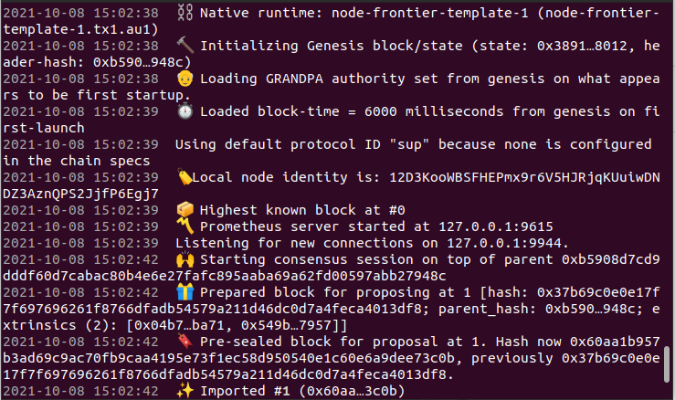

##### 合约部署

如果需要使用wasm调用EVM合约则需要先将wasm合约部署到链节点上，反之亦然。

这里为了后面的验证，将两种类型的合约都提前在链上部署。如果不知道合约部署实现参考以下文档实现节点对不同合约的支持及RPC接口的使用。

wasm合约：[Runtime中对contract的使用](https://substrate.dev/docs/zh-CN/tutorials/add-contracts-pallet/)

EVM合约：[Substarte Frontier工作坊](https://substrate.dev/docs/zh-CN/tutorials/frontier/)

完成以上两个教程，重新启动节点。以下只介绍合约的部署及部署成功界面：

使用[Polkadot-JS App UI](https://polkadot.js.org/apps/?rpc=ws%3A%2F%2F127.0.0.1%3A9944#/extrinsics)测试节点合约调用，进入界面选择本地网络节点，点击切换即可看到当前设备的节点网络。

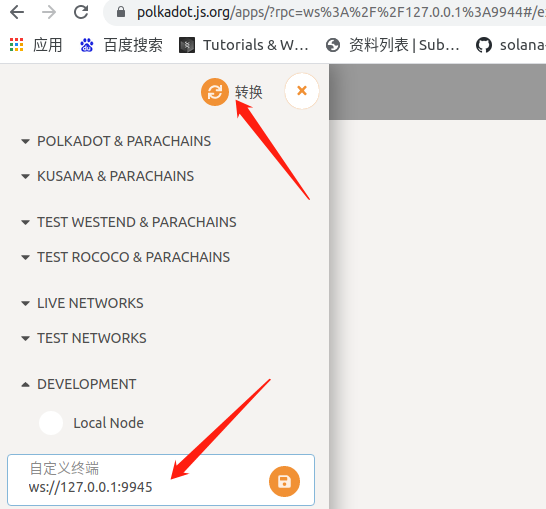

###### 部署wasm合约

开发者->合约->Upload & deploy code,选择一个可用账户余额不为0的账户执行测试。点击上传.contract的合约文件next之到确认部署界面，这里“捐赠"行需要给定一定数量的Unit。否则部署不成功，如图所示：

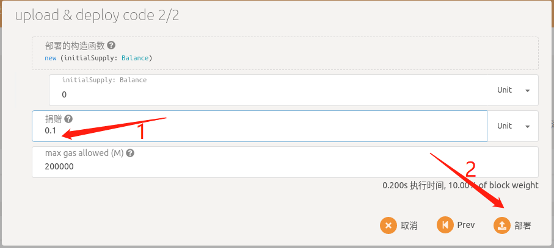

部署成功之后可在当前界面看到已经存在的合约文件：

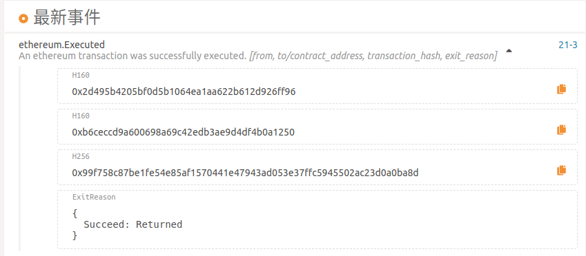

###### 部署EVM合约

使用[Remix](https://remix.ethereum.org/#optimize=true&runs=200&evmVersion=null&version=soljson-v0.6.12+commit.27d51765.js)进行合约的部署，打开连接新建文件粘贴已实现的合约文件编译。

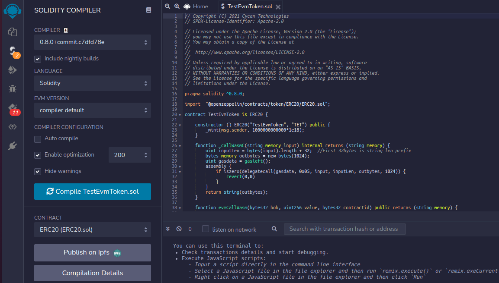

合约编译成功如上所示，接下来连接matemask部署evm合约：

1、打开matemask连接到本地节点：网络->自定义RPC

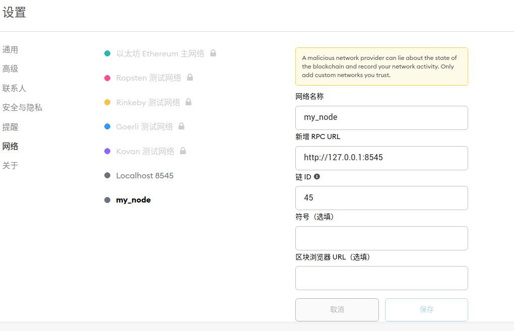

网络名词自己定义；RPC URL当前是在本地且端口在启动时已指定；链ID为Runtime实现EVM时自己设置的值，建议不用默认42，防止冲突。保存即可。

2、Remix->DEPLOY & RUN TRANSACTIONS配置如下：

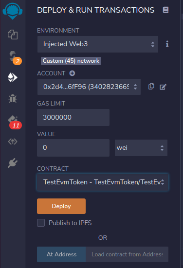

ENVIRONMENT：选择Injected Web3之后会自动识别到当前节点链id网络

ACCOUNT：matemaks的钱包地址

GAS LIMIT:	使用默认值

CONTRACT：上一步编译的合约文件

3、点击Deploy之后matemask确认即可看到合约部署成功返回信息：

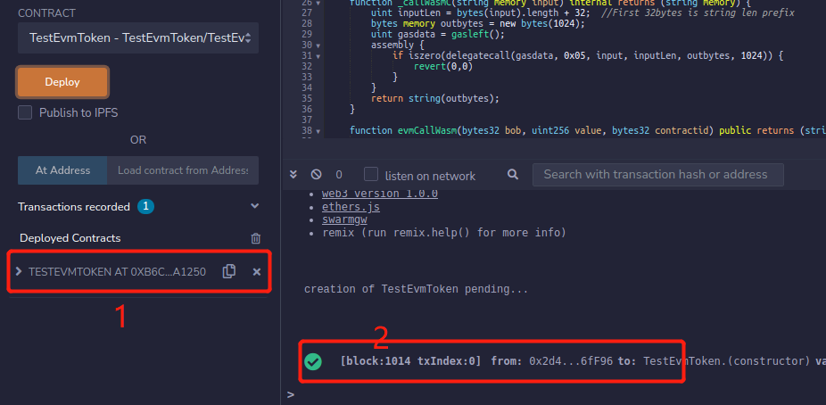

2处返回信息可以看到合约已经部署成功，展开1处即可看到当前合约部署的地址及合约接口。

#### 合约调用

##### evm call wasm

在做合约互调之前，当前测试合约中evm合约分配了合约代币，在测试之前需给各调用账户转账保证账户余额充足。如下给Alice账户转账：

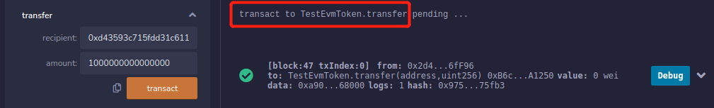

注意交易接口转账中参数，recipient: 20个字节的交易地址；amount： 交易金额（这里建议多转一些，避免后续操作因为金额不足报错）。

展开上一步中合约部署返回的合约地址下面的函数接口，为简单展示接口调用结果及参数说明以evmCallWasmBalance为例调用：

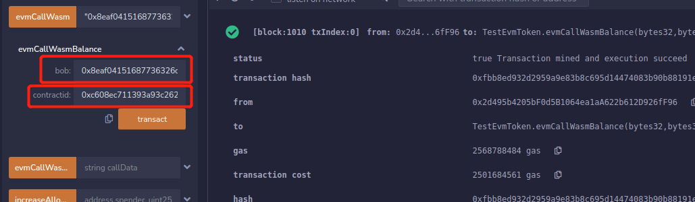

根据合约实现接口函数可以知道：

```sh
function evmCallWasmBalance(bytes32 bob, bytes32 contractid) public returns (uint) {
		
		bytes memory input1 = bytes('{"VM":"wasm", "Account":"0x');
		input1 = _bytesConcat(input1, bytes(_bytes32tohex(contractid)));
		input1 = _bytesConcat(input1, bytes('", "Fun": "balance_of", "InputType": ["accountid"], "InputValue": ["0x'));
		input1 = _bytesConcat(input1, bytes(_bytes32tohex(bob)));
		input1 = _bytesConcat(input1, bytes('"], "OutputType":[["u128"]]}'));
		
		//string input = '{"VM":"wasm", "Account":"0x' + _bytes32tohex(contractid) + '", "Fun": "balance_of", "InputType": ["accountid"], 
		//"InputValue": ["0x' + _bytes32tohex(bob)], "OutputType":[["u128"]]}';
		
		string memory result = _callWasmC(string(input1));
		return getResultBalance(result);
	}
```

bob：需要做balance_of操作的账户地址（32字节地址）；

contractid: 需要通过当前EVM合约桥接到需要调用的ink合约地址（32字节地址）。

点击transact即可，在Remix界面即可看到调用成功信息如上所以。

contractid合约地址的获取，可通过以下方式得到：

在[Polkadot-JS App UI](https://polkadot.js.org/apps/?rpc=ws%3A%2F%2F127.0.0.1%3A9944#/extrinsics)中可以看到已经部署成功的ink合约

开发者->合约：展开合约可以看到里面的合约调用接口，exec展开一个接口几个看到合约地址信息：

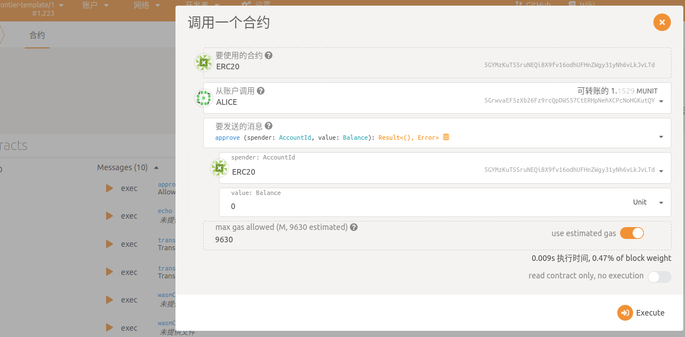

要使用的合约ERC20既我们刚刚部署的支持桥接互调的合约文件，复制后面的地址，通过subkey工具将SS58格式地址转换为hex地址即可使用。

例如：subkey inspect  5GrwvaEF5zXb26Fz9rcQpDWS57CtERHpNehXCPcNoHGKutQY   

##### wasm call evm

开发者->合约，可以看到部署完成的合约文件及hash码。点开Message可以直接看到合约中实现的调用方法。

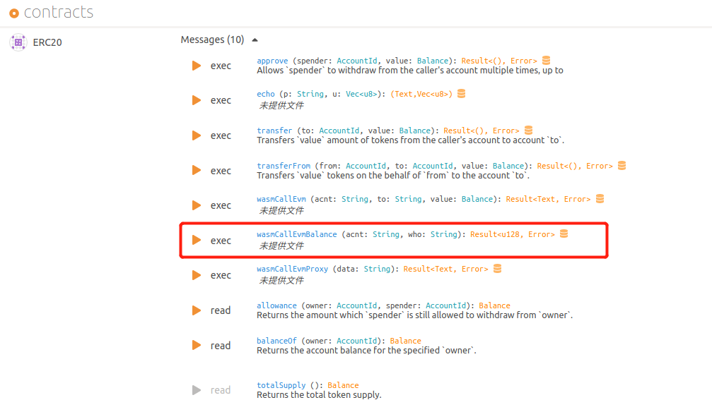

可以看到在合约中实现的外部调用函数，同样为简单展示接口调用结果及参数说明以wasmCallEvmBalance为例，展开exec:

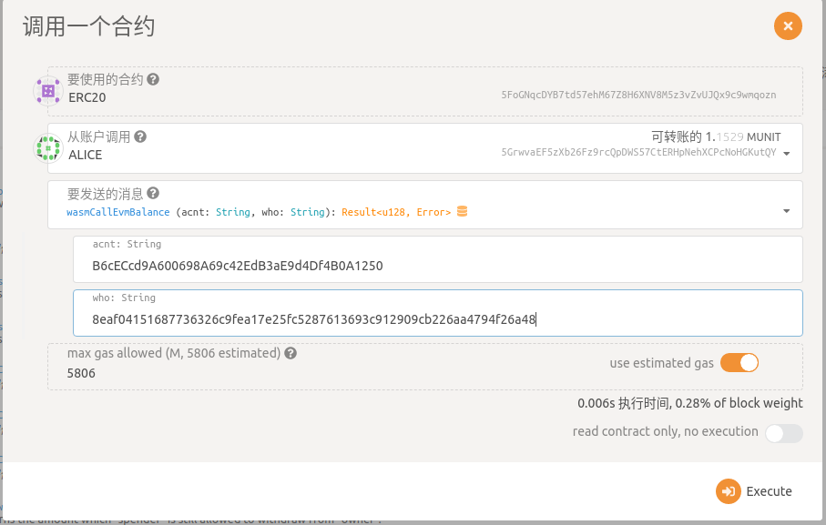

函数的合约代码：

```sh
#[ink(message)]
        pub fn wasmCallEvmBalance(
            &mut self,
            acnt: String,
            who: String,
        ) -> Result<Balance> {
            //let caller = self.env().caller();

			let mut input = r#"{"VM":"evm", "Account":""#.to_string();
			input.push_str(&acnt);
			input.push_str(r#"", "Fun":"balanceOf(address)", "InputType":["address"], "InputValue":[""#);
			input.push_str(&who);
			input.push_str(r#""],  "OutputType":[["uint"]]}"#);
			
			//input = '{"VM":"evm", "Account":"0x' + acnt.to_string() + '", "Fun":"balanceOf(address)", "InputType":["address"], 
			//"InputValue":["0x' + to.to_string()"],  "OutputType":[["uint"]]}';
			
            let ret = self.env().extension().call_evm_extension(&input);
			let return_value_offset: usize;
			match ret.find(r#""ReturnValue":[""#) {
				Some(r) => return_value_offset = r,
				None => return Err(Error::OtherError(String::from("Call EVM error, no ReturnValue!"))),
			}
			let result: Balance;
			match ret[return_value_offset+16..ret.len()-3].parse::<Balance>() {
				Ok(r) => result = r,
				Err(e) => return Err(Error::OtherError(e.to_string())),
			}
            Ok(result)
        }	
```

通过函数可以知道各个参数的含义：

acnt: 需要通过当前wasm合约桥接到需要调用的EVM合约地址；

who: 查询balanceof的账户地址；

注：由于测试使用的Polkadot-JS界面在识别0x时不认为属于字符串中，这里在调用交易接口时不需要传入0x的十六进制地址表示符。

点击Exceute即可。UI界面可以看到返回成功的信息，也可以通过[Polkadot-JS App UI](https://polkadot.js.org/apps/?rpc=ws%3A%2F%2F127.0.0.1%3A9944#/extrinsics)网络->浏览->链信息->最新事件：


当使用合约调用交易接口时，需要保证账户中余额充足，在使用[Polkadot-JS App UI](https://polkadot.js.org/apps/?rpc=ws%3A%2F%2F127.0.0.1%3A9944#/extrinsics)开发者-合约，调用wasmCallEvm调用evm合约做交易时，界面显示value:Balance  与合约中值转换关系为：1 Uint = 1000000000000。所以在调用该接口前需要先通过evm合约给对应的转账账户充值保证足够的金额转账。

#### 备注

以上就是GVM Bridge pallet在使用时的步骤，链启动之后可使用项目中提供的[合约文件](https://github.com/CycanTech/GVM-Bridge/blob/main/frame/vm-bridge/fixtures)测试及通过[合约源码](https://github.com/CycanTech/GVM-Bridge/tree/main/external/contract/src)生成生成需要的文件。在测试账户中尽量确保当前使用账户有余额，提交交易时不需要费用，但是在部署wasm合约时需要有一定捐赠。当前使用案例[github]( https://github.com/luo4lu/frontier_for_gvm.git)可用代码。以及当前所使用的[GVM-bridge](https://github.com/luo4lu/GVM_bridge.git)代码。

#### 其他

为了方便开发人员开发合同内部调用函数，我们将提供WASM合约和EVM合约内部调用的样例代码，如ERC20合同内部调用等。

